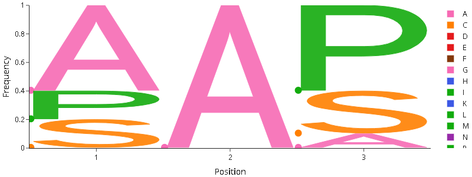

# Plotly-Logo
A Python library for making amino acid sequence logos using the Plotly framework.
Originally written to work with amino acid alignments (forked from https://github.com/kevinkovalchik/Plotly-Logo).
This code is designed to work as an interactive drop-in replacement for Logomaker (https://github.com/jbkinney/logomaker) and therefore drops most of the alignment-related code.

## Usage
Consider a matrix of Characters vs. Position encoding for string weight (e.g. from relative counts).

|   | G   | P   | A   |
|---|-----|-----|-----|
| 0 | 0.2 | 0.2 | 0.6 |
| 1 | 0   | 0   | 1   |
| 2 | 0.3 | 0.6 | 0.1 |

This will be transformed into an interactive sequence showing the prevalence of every amino acid on every position.
In the interactive versions, hovering over the points shows a popup info.

